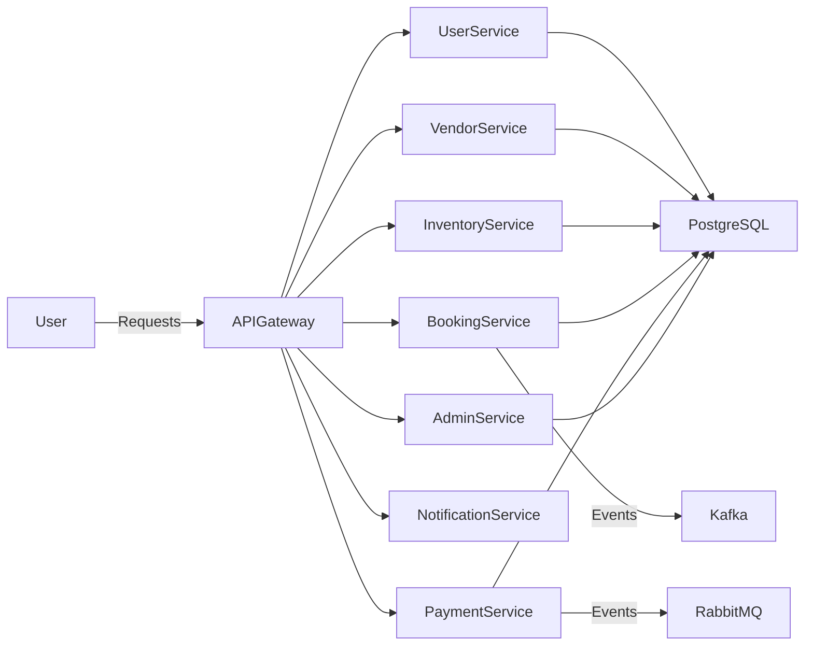

# RENTFLEX---PUBLIC

<div align="center">

### *Empowering Seamless Rentals, Accelerating Growth Everywhere*


### Built with the tools and technologies:


</div>

---

## 🌟 Overview

**RentFlex---Public** is a scalable, microservices-based rental marketplace platform that enables vendors to list items and users to browse, book, and manage rentals efficiently. Built with Spring Boot, Docker, Kubernetes, Kafka, and RabbitMQ, it offers a robust environment for enterprise-grade operations.

---

## 🎯 Why RentFlex?

This project streamlines the development of multi-vendor rental systems by providing a modular, secure, and highly available architecture. The core features include:

### 🔧 **Microservices Architecture**
Modular services for booking, vendor, user, inventory, payments, and notifications ensure scalability and maintainability.

### 🚀 **Containerized Deployment**
Built with Docker and orchestrated with Kubernetes for seamless deployment and scaling.

### 🔒 **Secure & Reliable**
Implements secure authentication, data persistence, and enterprise-grade security configurations.

### 📚 **Comprehensive API Documentation**
Simplifies integration with Swagger and API Gateway for unified API management.

### ⚡ **Real-Time Messaging**
Utilizes Kafka and RabbitMQ for efficient, event-driven communication across services.

### 🌐 **Developer-Friendly**
Supports RESTful APIs, CORS, and environment-specific configurations for smooth development and testing.

---

## ❓ Problem Statement

People often want to **rent items (tools, vehicles, furniture, gadgets, etc.)** instead of buying, but there is **no good scalable platform** that allows vendors to list and manage rentals efficiently.

---

## 💡 Solution Overview

**RentFlex** provides a multi-vendor rental marketplace where:
- ✅ Vendors can list items with availability, pricing, and terms
- ✅ Customers can search, book, and manage rentals
- ✅ The system ensures **secure payments, booking management, and vendor-user interactions**
- ✅ Scalable architecture implemented with **Microservices, Kafka, RabbitMQ, Docker, and Kubernetes**

---

## ✨ Key Features

| Feature | Description |
|---------|-------------|
| 🏪 **Multi-Vendor Support** | Vendor registration & inventory management |
| 📋 **Category-Based Listing** | Item listing with availability calendar |
| 📅 **Rental Booking System** | Complete booking & scheduling system |
| 🔐 **Secure Authentication** | OAuth2 / JWT implementation |
| 💼 **Order Management** | Invoice generation and order tracking |
| 📧 **Notifications** | Email/SMS/push notifications (future scope) |
| 💳 **Payment Integration** | Payment gateway integration (future scope) |
| 👨‍💼 **Admin Dashboard** | Monitor vendors and users |

---

## 🏗️ System Architecture



---

## 🛠️ Tech Stack

### Backend Technologies
- **Java 21** - Programming language
- **Spring Boot 3.x** - Application framework
- **Spring Security** - Authentication and authorization
- **Spring Data JPA** - Data access layer
- **Spring Web** - REST API development
- **Spring Validation** - Input validation

### Database
- **MySQL** - Primary database

### Messaging & Events
- **Apache Kafka** - Event streaming
- **RabbitMQ** - Message broker

### API & Gateway
- **Spring Cloud Gateway** - API Gateway
- **Eureka** - Service Discovery

### Documentation & Testing
- **Swagger/OpenAPI 3** - API documentation
- **JUnit 5** - Unit testing
- **MockMvc** - Web layer testing

### DevOps & Deployment
- **Docker** - Containerization
- **Kubernetes** - Orchestration
- **Maven** - Build automation
- **Spring Boot DevTools** - Development productivity

---

## 🔧 Microservices Breakdown

| Service | Description |
|---------|-------------|
| 👤 **User Service** | Handles user registration, login, authentication |
| 🏪 **Vendor Service** | Vendor onboarding, profile, and management |
| 📦 **Inventory Service** | Item listings, categories, availability |
| 📅 **Booking Service** | Rental booking, scheduling, and cancellations |
| 💳 **Payment Service** | Payment processing (future scope) |
| 📧 **Notification Service** | Email/SMS/push notifications |
| 👨‍💼 **Admin Service** | Manage vendors, users, and platform data |

---

## 🗂️ Database Design

### Core Entities

```
📊 User
├── id (PK)
├── name
├── email
├── password
├── role
├── status
└── createdAt

🏪 Vendor
├── id (PK)
├── vendorName
├── contactInfo
└── rating

📦 Item
├── id (PK)
├── vendorId (FK)
├── category
├── name
├── description
├── pricePerDay
└── availability

📅 Booking
├── id (PK)
├── userId (FK)
├── itemId (FK)
├── startDate
├── endDate
└── status

💳 Payment
├── id (PK)
├── bookingId (FK)
├── amount
├── status
└── paymentMethod
```

---

## 📡 API Endpoints

### User Management
```http
POST   /api/users/register          # Register user
POST   /api/users/login              # Authenticate user
```

### Vendor Management
```http
POST   /api/vendors/register         # Vendor registration
GET    /api/vendors/{id}             # Get vendor details
```

### Inventory Management
```http
POST   /api/items                    # Add rental item
GET    /api/items/{id}               # Get item details
GET    /api/items                    # List all items
PUT    /api/items/{id}               # Update item
DELETE /api/items/{id}               # Delete item
```

### Booking Management
```http
POST   /api/bookings                 # Create booking
GET    /api/bookings/user/{id}       # Get user bookings
GET    /api/bookings/{id}            # Get booking details
PUT    /api/bookings/{id}/cancel     # Cancel booking
```

### Payment Management
```http
POST   /api/payments                 # Process payment
GET    /api/payments/{id}            # Get payment details
```

---

## 📋 Prerequisites

Before running this project, ensure you have:

- **Java 21+** ☕
- **Maven 3.8+** 📦
- **Docker** 🐳
- **Kubernetes** ☸️
- **MySQL** 🗄️
- **Kafka** 📨
- **RabbitMQ** 🐰

---

## 🚀 Installation & Setup

### 1. Clone the Repository
```bash
git clone https://github.com/surajktdev/RentFlex---Public.git
cd RentFlex---Public
```

### 2. Configure Database
Update `application.properties` with your MySQL credentials:
```properties
spring.datasource.url=jdbc:mysql://localhost:3306/rentflex
spring.datasource.username=your_username
spring.datasource.password=your_password
```

### 3. Build the Project
```bash
mvn clean install
```

### 4. Run with Docker
```bash
docker-compose up -d
```

### 5. Access the Application
- **API Gateway**: `http://localhost:8080`
- **Swagger UI**: `http://localhost:8080/swagger-ui.html`
- **Eureka Dashboard**: `http://localhost:8761`

---

## 🐳 Docker & Kubernetes

### Docker Deployment
```bash
# Build all services
docker-compose build

# Start all services
docker-compose up -d

# View logs
docker-compose logs -f

# Stop all services
docker-compose down
```

### Kubernetes Deployment
```bash
# Apply configurations
kubectl apply -f k8s/

# Check pod status
kubectl get pods

# View service logs
kubectl logs <pod-name>

# Scale service
kubectl scale deployment <service-name> --replicas=3
```

---

## 🔮 Future Enhancements

- [ ] Complete payment gateway integration (Stripe/PayPal)
- [ ] Advanced search and filtering
- [ ] Real-time notifications (WebSocket)
- [ ] Mobile app development (React Native/Flutter)
- [ ] AI-based recommendation system
- [ ] Review and rating system
- [ ] Multi-language support
- [ ] Analytics dashboard
- [ ] Insurance integration
- [ ] Delivery tracking system

---

## 🤝 Contributing

Contributions are welcome! Please follow these steps:

1. Fork the repository
2. Create a feature branch (`git checkout -b feature/AmazingFeature`)
3. Commit your changes (`git commit -m 'Add some AmazingFeature'`)
4. Push to the branch (`git push origin feature/AmazingFeature`)
5. Open a Pull Request

---

## 📄 License

This project is licensed under the MIT License - see the [LICENSE](LICENSE) file for details.

---

## 👨‍💻 Author

**Suraj Kumar**
- GitHub: [@surajktdev](https://github.com/surajktdev)
- Project Link: [RentFlex---Public](https://github.com/surajktdev/RentFlex---Public)

---

<div align="center">

### ⭐ Star this repository if you find it helpful!

Made with ❤️ by Suraj Kumar

</div>
