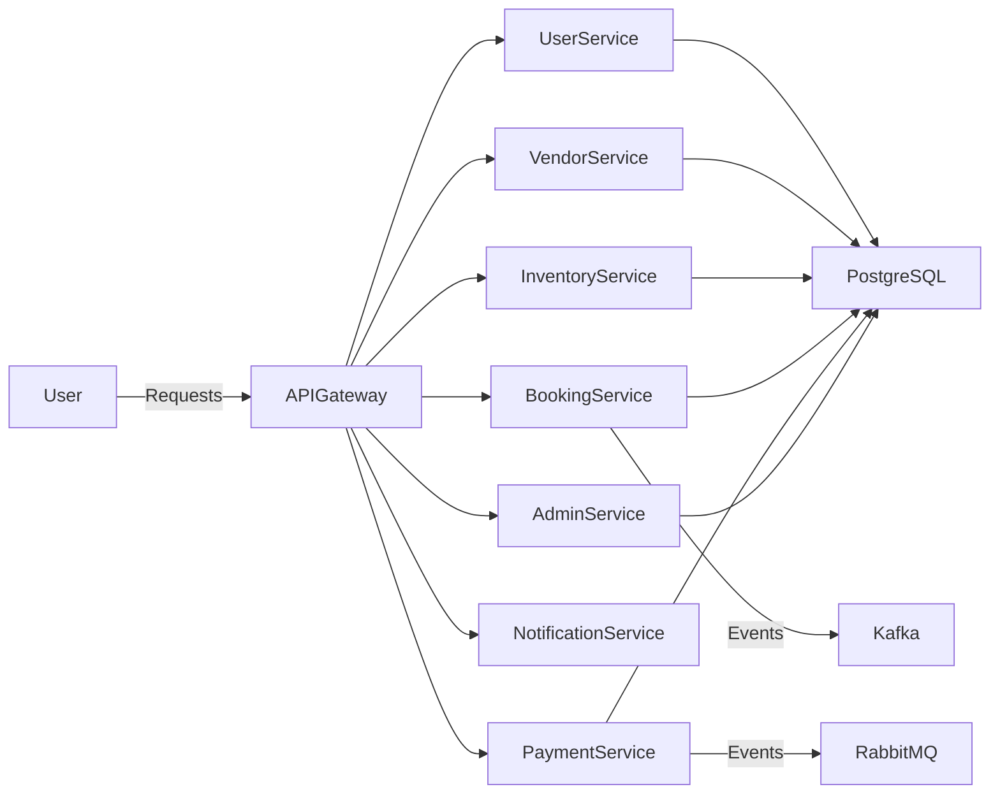

# RentFlex – Multi-Vendor Rental Marketplace

RentFlex is a **scalable multi-vendor rental marketplace** where vendors can list items (tools, vehicles, gadgets, furniture, etc.) for rent, and users can browse, book, and manage rentals.  
The project is built with **Spring Boot Microservices, Docker, Kubernetes, Kafka, and RabbitMQ**, designed to showcase enterprise-grade architecture.

---

## 📌 Table of Contents
1. [Problem Statement](#-problem-statement)  
2. [Solution Overview](#-solution-overview)  
3. [Key Features](#-key-features)  
4. [System Architecture](#-system-architecture)  
5. [Tech Stack](#-tech-stack)  
6. [Microservices Breakdown](#-microservices-breakdown)  
7. [Database Design](#-database-design)  
8. [API Endpoints](#-api-endpoints)  
9. [Installation & Setup](#-installation--setup)  
10. [Docker & Kubernetes](#-docker--kubernetes)  
11. [Future Enhancements](#-future-enhancements)  

---

## ❓ Problem Statement
People often want to **rent items (tools, vehicles, furniture, gadgets, etc.)** instead of buying, but there is **no good scalable platform** that allows vendors to list and manage rentals efficiently.

---

## 💡 Solution Overview
**RentFlex** provides a multi-vendor rental marketplace where:  
- Vendors can list items with availability, pricing, and terms.  
- Customers can search, book, and manage rentals.  
- The system ensures **secure payments, booking management, and vendor-user interactions**.  
- Scalable architecture is implemented with **Microservices, Kafka, RabbitMQ, Docker, and Kubernetes**.  

---

## ✨ Key Features
- Multi-vendor support with vendor registration & inventory management  
- Category-based item listing with availability calendar  
- Rental booking & scheduling system  
- Secure authentication & authorization (OAuth2 / JWT)  
- Order management & invoice generation  
- Notifications (email/SMS/push – future scope)  
- Payment gateway integration (future scope)  
- Admin dashboard for monitoring vendors and users  

---

## 🏗 System Architecture

## 🛠️ Tech Stack

### Backend Technologies
- **Java 21** - Programming language
- **Spring Boot 3.x** - Application framework
- **Spring Security** - Authentication and authorization
- **Spring Data JPA** - Data access layer
- **Spring Web** - REST API development
- **Spring Validation** - Input validation

### Database
- **MySQL** - Primary database

### Documentation & Testing
- **Swagger/OpenAPI 3** - API documentation
- **JUnit 5** - Unit testing
- **MockMvc** - Web layer testing

### Build & Development
- **Maven** - Build automation
- **Docker** - Containerization
- **Orchestration:** Kubernetes
- **Spring Boot DevTools** - Development productivity

## 📋 Prerequisites
- **Maven 3.8+**
- **API Gateway:** Spring Cloud Gateway  
- **Service Discovery:** Eureka  
- **Messaging:** Kafka (event streaming), RabbitMQ (message broker)  

---

## 🔧 Microservices Breakdown
- **User Service** – Handles user registration, login, authentication  
- **Vendor Service** – Vendor onboarding, profile, and management  
- **Inventory Service** – Item listings, categories, availability  
- **Booking Service** – Rental booking, scheduling, and cancellations  
- **Payment Service** – Payment processing (future scope)  
- **Notification Service** – Email/SMS/push notifications  
- **Admin Service** – Manage vendors, users, and platform data  

---

## 🗂 Database Design (example entities)
- **User:** `id, name, email, password, role, status, createdAt`  
- **Vendor:** `id, vendorName, contactInfo, rating`  
- **Item:** `id, vendorId, category, name, description, pricePerDay, availability`  
- **Booking:** `id, userId, itemId, startDate, endDate, status`  
- **Payment:** `id, bookingId, amount, status, paymentMethod`  

---

## 📡 API Endpoints (sample)
- `POST /api/users/register` → Register user  
- `POST /api/users/login` → Authenticate user  
- `POST /api/vendors/register` → Vendor registration  
- `POST /api/items` → Add rental item  
- `GET /api/items/{id}` → Get item details  
- `POST /api/bookings` → Create booking  
- `GET /api/bookings/user/{id}` → Get user bookings  
- `POST /api/payments` → Process payment  

---
